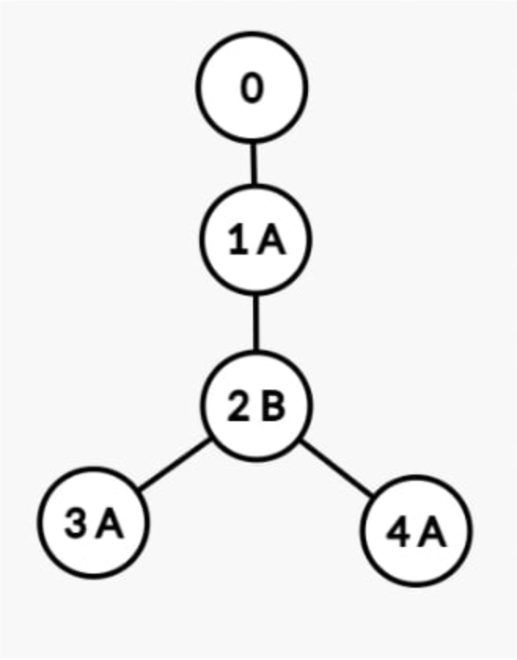

### Задача 4 - D. Межпланетная организация

|                        | Все языки |
| ---------------------- | --------- |
| Ограничения по времени | 5 секунды |
| Ограничения памяти     | 512MB     |
Межпланетная организация имеет иерархическую древовидную структуру:
- Корнем иерархии является генеральный директор;
- У каждого сотрудника 0 или более непосредственных подчиненных;
- Каждый сотрудник, кроме генерального директора, является непосредственным подчиненным ровно одному сотруднику.

Каждый сотрудник, кроме генерального директора, говорит либо на языке А, либо на языке В Директор говорит на двух языках для управления всей организацией.

Структура всей организации хранится в текстовом документе. Каждый сотрудник представлен уникальным идентификатором - целым числом от 0 до N включительно, где 0 - идентификатор генерального директора.|

Каждый сотрудник представлен в документе ровно два раза. Между первым и вторым вхождением идентификатора сотрудника в аналогичном формате представлены все его подчиненные.

Если у сотрудника нет подчиненных, то два его идентификатора расположены один за другим.
Например, если
- генеральный директор имеет в прямом подчинении сотрудника 1;
- сотрудник 1 имеет в прямом подчинении сотрудника 2;
- сотрудник 2 имеет в прямом подчинении сотрудников 3 и 4;
  то документ будет представлен в виде строки: 0 1 2 3 3 4 4 2 1 0

Если при этом сотрудники 1, 3, 4 говорят на языке А, а сотрудник 2 говорит на языке В, то вся организация выглядит так:

Назовем языковым барьером сотрудника Х минимальное количество начальников между Х и его начальником с таким же языком.

В нашем случае сотрудники 2, 3 и 4 - имеют языковой барьер 1, т.к. у каждого из них начальник говорит на неизвестном для них языке, а сразу следующий начальник говорит на том же языке, что они. В то же время сотрудник 1 имеет языковой барьер равный 0, поскольку его начальник - это директор, который знает два языка.

Вычислить языковой барьер для каждого сотрудника в компании.
#### Формат ввода
В первой строке задано целое число N (1 ≤ N < 10^6) — количество сотрудников (без генерального директора).
Во второй строке через пробел задано N символов Li (Li € {A, B}) — язык і-го сотрудника.

В третьей строке через пробел задано 2 * (N + 1) целых чисел Рj (0 < Pj ≤ N) — иерархия организации в описанном в условии формате.

Гарантируется, что первый и последний элементы иерархии равны 0.
#### Формат вывода
Выведите N целых чисел через пробел — языковой барьер каждого сотрудника от 1 до N включительно.
#### Примеры

| Ввод                                | Вывод     |
| ----------------------------------- | --------- |
| 5 A B B A B                      | 0 0 0 2 0 |
| 4 A B A A 0 1 2 3 3 4 4 2 1 0 | 0 1 1 1   |

